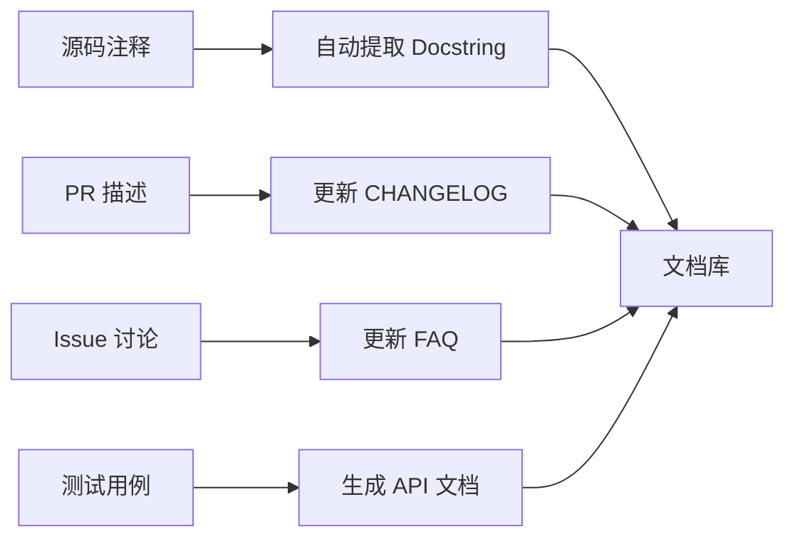

# 工作流设计模式

> 本文档汇总了 Agent 驱动开发（AIDD）中的工作流设计模式，覆盖 CI/CD 流水线、自动化工作流和 Agent 协作模式。

## 概述

工作流设计模式是解决**重复性工程问题**的通用方案。在 AI Agent 和自动化时代，良好的工作流设计能显著提升开发效率和代码质量。

### 模式分类

| 类别 | 模式 | 适用场景 |
|------|------|---------|
| CI/CD | 持续集成、持续部署 | 自动构建测试 |
| 自动化 | 定时任务、事件触发 | 日常运维 |
| Agent | Planner-Executor | 复杂任务分解 |
| 审查 | 分层审查流水线 | 质量控制 |
| 知识 | 知识库同步 | 文档管理 |

---

## 1. Planner-Executor 模式

### 概念

```
问: "实现用户认证系统"
     ↓
Planner: 分解为子任务
    ├── 1. 数据库模型设计
    ├── 2. API 端点实现
    ├── 3. 前端登录页面
    └── 4. 单元测试
     ↓
Executor: 并行执行子任务
    ├── Agent A → 模型设计
    ├── Agent B → API 实现
    ├── Agent C → 前端组件
    └── Agent D → 测试编写
     ↓
协调者: 合并结果 → 提交 PR
```

### 实现框架

```python
from typing import List, Dict
from pydantic import BaseModel

class Task(BaseModel):
    id: str
    description: str
    dependencies: List[str] = []
    status: str = "pending"
    result: str = ""

class Plan(BaseModel):
    goal: str
    tasks: List[Task]
    
class PlannerExecutor:
    """Planner-Executor 模式实现"""
    
    def plan(self, goal: str) -> Plan:
        """将目标分解为子任务"""
        tasks = [
            Task(id="1", description="需求分析"),
            Task(id="2", description="架构设计", dependencies=["1"]),
            Task(id="3", description="代码实现", dependencies=["2"]),
            Task(id="4", description="测试验证", dependencies=["3"]),
        ]
        return Plan(goal=goal, tasks=tasks)
    
    def execute(self, plan: Plan) -> Dict[str, str]:
        """执行任务（并行执行无依赖的任务）"""
        results = {}
        while plan.tasks:
            # 找出所有依赖已满足的任务
            ready = [t for t in plan.tasks 
                    if all(d in results for d in t.dependencies)]
            
            for task in ready:
                # 执行任务
                results[task.id] = self._run_task(task)
                task.status = "completed"
                plan.tasks.remove(task)
        
        return results
    
    def _run_task(self, task: Task) -> str:
        """运行单个任务"""
        print(f"  ▶ 执行: {task.description}")
        return f"{task.description} 完成"

# 使用
pe = PlannerExecutor()
plan = pe.plan("实现新功能")
results = pe.execute(plan)
```

### 适用场景

| 场景 | 说明 | 效果 |
|------|------|------|
| 大型功能开发 | 分解为可并行的小任务 | 速度提升 2-3x |
| Bug 修复 | 分析 → 复现 → 修复 → 验证 | 系统性解决 |
| 代码审查 | 静态分析 → 人工审查 → 性能评估 | 全面覆盖 |
| 知识库构建 | 索引 → 内容生成 → 交叉引用 | 结构化管理 |

---

## 2. 分层审查流水线

### 流水线结构

```
代码提交
    ↓
[L1] 预提交检查 (5秒)
    ├── 格式检查 (ruff/prettier)
    ├── 类型检查 (mypy/tsc)
    └── Secret 扫描 (gitleaks)
    ↓
[L2] 自动审查 (2分钟)
    ├── 静态分析 (CodeQL/Semgrep)
    ├── 单元测试 (pytest/jest)
    └── 依赖审计 (Dependabot)
    ↓
[L3] 人工审查 (30分钟)
    ├── 代码逻辑审查
    ├── 安全审查
    └── 架构合规
    ↓
[L4] 集成检查 (10分钟)
    ├── 集成测试
    ├── 性能测试 (基准对比)
    └── E2E 测试
    ↓
合并 → 部署
```

### GitHub Actions 实现

```yaml
# .github/workflows/review-pipeline.yml
name: Review Pipeline

on:
  pull_request:
    types: [opened, synchronize, ready_for_review]

jobs:
  # L1: 预提交检查
  lint:
    name: L1 — 代码格式
    runs-on: ubuntu-latest
    steps:
      - uses: actions/checkout@v4
      - run: pip install ruff && ruff check src/

  security-scan:
    name: L1 — 安全扫描
    runs-on: ubuntu-latest
    steps:
      - uses: actions/checkout@v4
      - uses: gitleaks/gitleaks-action@v2

  # L2: 自动审查
  static-analysis:
    name: L2 — 静态分析
    needs: lint
    runs-on: ubuntu-latest
    steps:
      - uses: actions/checkout@v4
      - uses: github/codeql-action/analyze@v3

  test:
    name: L2 — 单元测试
    needs: lint
    runs-on: ubuntu-latest
    steps:
      - uses: actions/checkout@v4
      - run: |
          pip install pytest pytest-cov
          pytest tests/ --cov=src --junitxml=test-results.xml
      - uses: dorny/test-reporter@v1
        if: success() || failure()
        with:
          name: Test Results
          path: test-results.xml
          reporter: java-junit

  # L3: 集成测试
  integration:
    name: L4 — 集成测试
    needs: test
    runs-on: ubuntu-latest
    steps:
      - uses: actions/checkout@v4
      - run: |
          docker compose -f docker-compose.test.yml up --abort-on-container-exit
```

---

## 3. 定时任务自动化

### 常见的定时工作流

```yaml
# .github/workflows/scheduled-tasks.yml
name: Scheduled Tasks

on:
  schedule:
    - cron: '0 0 * * *'      # 每天 midnight
    - cron: '0 9 * * 1'      # 每周一 9:00
    - cron: '0 0 1 * *'      # 每月 1 日

jobs:
  dependency-check:
    runs-on: ubuntu-latest
    steps:
      - uses: actions/checkout@v4
      - name: 检查过时依赖
        run: |
          pip list --outdated
          npm outdated

  stale-issue-cleanup:
    runs-on: ubuntu-latest
    steps:
      - uses: actions/stale@v9
        with:
          days-before-stale: 60
          days-before-close: 14
          stale-issue-label: 'stale'
          stale-issue-message: '此 Issue 已 60 天未更新，将被关闭'
```

### 智能定时器模式

```python
import schedule
import time
from datetime import datetime

class SmartScheduler:
    """智能定时任务调度器"""
    
    def __init__(self):
        self.tasks = []
    
    def add_task(self, name, func, interval_hours, 
                 business_hours_only=True):
        """添加定时任务"""
        self.tasks.append({
            'name': name,
            'func': func,
            'interval': interval_hours,
            'business_only': business_hours_only,
            'last_run': None
        })
    
    def should_run(self, task):
        """判断任务是否该执行"""
        now = datetime.now()
        
        # 业务时间检查（9:00-18:00）
        if task['business_only'] and not (9 <= now.hour < 18):
            return False
            
        # 周末检查
        if task['business_only'] and now.weekday() >= 5:
            return False
        
        # 间隔检查
        if task['last_run']:
            elapsed = (now - task['last_run']).total_seconds() / 3600
            if elapsed < task['interval']:
                return False
        
        return True
    
    def run_pending(self):
        """运行到期的任务"""
        for task in self.tasks:
            if self.should_run(task):
                print(f"▶ 执行: {task['name']}")
                task['func']()
                task['last_run'] = datetime.now()

# 使用
scheduler = SmartScheduler()

def backup_database():
    print("备份数据库...")

def generate_report():
    print("生成周报...")

scheduler.add_task("数据库备份", backup_database, interval_hours=6)
scheduler.add_task("周报生成", generate_report, interval_hours=168)

while True:
    scheduler.run_pending()
    time.sleep(60)
```

---

## 4. 事件驱动模式

### Webhook 驱动

```
GitHub 事件 → Webhook → 触发流水线
    ↑                        ↓
推送 PR 变更              构建部署
                          ↓
                      发送通知
```

### 配置示例

```yaml
# 事件 → 动作映射
events:
  push:
    branches: [main]
    actions:
      - deploy:production
      
  pull_request:
    types: [opened, synchronize]
    actions:
      - test
      - lint
      - code_review
  
  pull_request_review:
    types: [submitted]
    condition: review.state == "approved"
    actions:
      - merge
      - deploy:staging
  
  issues:
    types: [opened]
    actions:
      - triage  # 自动分类
      - assign  # 自动分配
```

---

## 5. 知识同步模式

### 文档自动生成



### 实现

```bash
# pre-commit 自动生成文档索引
#!/bin/bash
# .git/hooks/pre-commit
echo "📚 更新知识库索引..."
find docs/ -name "*.md" -exec grep -l "^# " {} \; | \
  while read file; do
    title=$(head -1 "$file" | sed 's/^# //')
    echo "- [$title]($file)"
  done > docs/INDEX.md

git add docs/INDEX.md
```

---

## 相关技能

- [[01-repo-best-practices]] — 仓库管理最佳实践
- [[03-collaboration-patterns]] — 协作工作流模式
- [[04-knowledge-management]] — 知识管理
- [[05-modern-dev-workflow]] — 现代开发工作流
