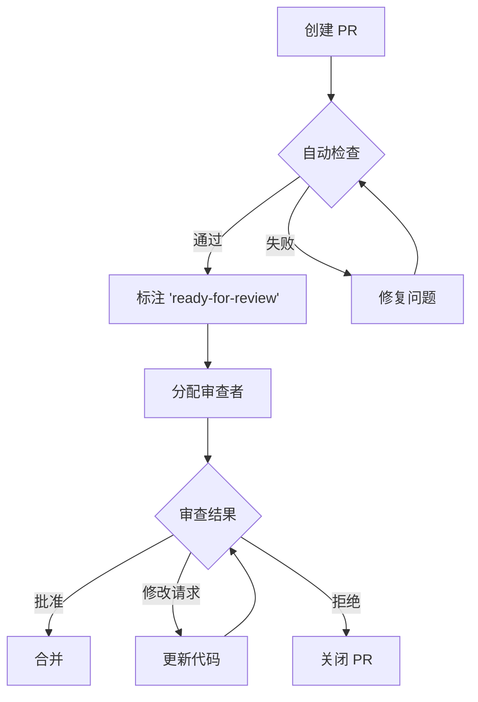

# 协作工作流模式

> 本文档汇总了团队协作中的工作流模式，覆盖 PR 创建与审查、Issue 管理、团队沟通和远程协作最佳实践。

## 概述

高效的协作工作流是团队生产力的倍增器。不论是开源项目还是企业内部项目，良好的协作模式能减少沟通成本、提高代码质量和加快交付速度。

### 协作三角

```
沟通
 ├── Issue 讨论（异步）
 ├── PR 审查（异步）
 └── 实时会议（同步）
 
协作工具
 ├── Git + GitHub（版本控制）
 ├── Project Board（任务管理）
 └── 文档（知识沉淀）

规范
 ├── 编码规范
 ├── 提交信息规范
 └── 审查标准
```

---

## 1. Pull Request 工作流

### PR 创建模板

```markdown
# .github/PULL_REQUEST_TEMPLATE.md

## 描述

请简要描述此 PR 的内容和动机。

关联 Issue: #ISSUE_NUMBER

## 类型

- [ ] ✨ 新功能
- [ ] 🐛 Bug 修复
- [ ] 📝 文档更新
- [ ] ♻️ 代码重构
- [ ] ⚡ 性能优化
- [ ] ✅ 测试
- [ ] 🔧 CI/构建

## 变更清单

- [ ] 代码已自测
- [ ] 单元测试已添加/更新
- [ ] 文档已更新
- [ ] 类型检查通过
- [ ] Lint 检查通过
- [ ] 无新增安全告警

## 测试步骤

1. ...
2. ...
3. ...

## 截图（如适用）

## 额外说明
```

### PR 命名规范

```
格式: <type>(<scope>): <description>

示例:
feat(auth): 添加 OAuth 2.0 登录支持
fix(api): 修复分页参数解析错误
docs(readme): 更新安装说明
refactor(db): 重构查询逻辑
test(payment): 添加支付单元测试
```

### PR 审查流程



### 审查响应标准

| 标记 | 含义 | 行动 |
|------|------|------|
| `🚀 LGTM` | 代码没问题 | 可以直接合并 |
| `💡 建议` | 非强制建议 | 可采纳也可忽略 |
| `🔧 需要修复` | 必须修复的问题 | 修复后重新审查 |
| `❌ 阻塞` | 设计或架构问题 | 需要讨论后再继续 |
| `❓ 疑问` | 不确定的代码 | 需要作者解释 |

---

## 2. Issue 管理

### Issue 模板

```markdown
# .github/ISSUE_TEMPLATE/bug_report.md
---
name: Bug 报告
about: 创建一个 Bug 报告帮助我们改进
title: "[Bug] "
labels: bug
assignees: ''
---

## 描述

清晰简洁地描述这个 Bug。

## 复现步骤

1. 打开 '...'
2. 点击 '....'
3. 看到错误

## 期望行为

期望应该发生什么？

## 截图

## 环境

- OS: [e.g. Ubuntu 22.04]
- Python 版本: [e.g. 3.11]
- 包版本: [e.g. v1.2.3]

## 额外上下文
```

### Issue 标签体系

| 类别 | 标签 | 说明 |
|------|------|------|
| 类型 | `bug`, `feature`, `enhancement`, `docs` | 标明 Issue 类型 |
| 优先级 | `priority:critical`, `priority:high`, `priority:medium`, `priority:low` | 紧急程度 |
| 状态 | `needs-triage`, `in-progress`, `blocked`, `needs-info` | 处理阶段 |
| 领域 | `frontend`, `backend`, `infra`, `security` | 所属模块 |
| 规模 | `size:small`, `size:medium`, `size:large` | 工作量估算 |

### Issue 三分类法

```
┌─────────────────────┐
│    待处理 (To Do)     │  ← 新创建的 Issue，尚未分配
├─────────────────────┤
│    进行中 (In Progress) │  ← 已分配，有人在处理
├─────────────────────┤
│    已完成 (Done)       │  ← 已解决或关闭
└─────────────────────┘
```

### 自动化 Issue 分类

```yaml
# .github/workflows/issue-triage.yml
name: Issue Triage

on:
  issues:
    types: [opened]

jobs:
  triage:
    runs-on: ubuntu-latest
    steps:
      - uses: actions/github-script@v7
        with:
          script: |
            const issue = context.payload.issue;
            const title = issue.title.toLowerCase();
            const body = issue.body.toLowerCase();
            
            // 自动添加标签
            const labels = [];
            
            if (body.includes('bug') || body.includes('错误') || 
                body.includes('异常')) {
              labels.push('bug');
            }
            if (body.includes('feature') || body.includes('建议') || 
                title.startsWith('feat')) {
              labels.push('feature');
            }
            if (body.includes('security') || body.includes('安全') || 
                body.includes('vulnerability')) {
              labels.push('security');
              labels.push('priority:critical');
            }
            
            if (labels.length > 0) {
              await github.rest.issues.addLabels({
                owner: context.repo.owner,
                repo: context.repo.repo,
                issue_number: issue.number,
                labels: labels
              });
            }
            
            // 自动分配
            if (labels.includes('bug')) {
              // 自动分配给最近的贡献者
            }
```

---

## 3. 提交信息规范

### Conventional Commits

```
<type>[optional scope]: <description>

[optional body]

[optional footer(s)]
```

### 类型对照表

| 类型 | 语义 | 是否出现在 CHANGELOG |
|------|------|---------------------|
| `feat` | 新功能 | ✅ |
| `fix` | Bug 修复 | ✅ |
| `docs` | 文档变更 | ❌ |
| `style` | 代码格式 | ❌ |
| `refactor` | 代码重构 | ❌ |
| `perf` | 性能优化 | ✅ |
| `test` | 测试相关 | ❌ |
| `chore` | 构建/工具 | ❌ |
| `ci` | CI 配置 | ❌ |

### 优秀的提交信息

```bash
# 好: 清晰的描述
git commit -m "feat(auth): 添加 GitHub OAuth 登录"
git commit -m "fix(api): 修复分页参数为负时的崩溃"
git commit -m "perf(db): 用连接池替代每次新建连接"

# 更好: 详细描述
git commit -m "fix(api): 修复分页参数验证错误

当传负数页码时，API 会返回 Internal Server Error。
现在改为返回 400 Bad Request 并提示错误信息。

Fixes #142"

# 不好: 模糊不清
git commit -m "修复bug"    # ❌
git commit -m "更新代码"    # ❌
git commit -m "改了些东西"  # ❌
```

---

## 4. 沟通模式

### 异步沟通最佳实践

1. **Issue 是讨论的起点**
   - 在 Issue 中讨论方案，而不是聊天工具
   - 重要的决策记录在 Issue 评论中
   - 使用 Thread 回复而非普通评论

2. **PR 是代码的讨论场所**
   - 代码相关讨论在 PR 中进行
   - 使用 Inline Comment 针对特定行
   - 不建议在 PR 中讨论架构变更

3. **文档是知识的归宿**
   - 每次讨论后有结论就更新文档
   - 避免"口头约定"
   - 使用 ADR（架构决策记录）

### 编码交流规范

```markdown
# 代码审查评论模板

## 提出建议
> 这里的命名可以考虑更清晰，比如 `processPayment()` 
> 是否比 `doIt()` 更好？

## 提出问题
> 这段逻辑我没理解，为什么需要检查两次？
> 能否加个注释说明？

## 提出修复
> 这里可能有 SQL 注入风险，
> 建议使用参数化查询替代字符串拼接。

## 提供参考
> 可以参考我们之前实现过的类似功能：
> src/services/payment.py:L42-L60
```

---

## 5. 远程团队协作

### 跨时区协作

```bash
# 使用 UTC 时间标注截止时间
# "请在 2024-05-10T15:00Z 前完成审查"

# 异步代码审查
# 避免"实时"等待回复
# 建议回复时限: 24 小时内
```

### 协作工具组合

| 用途 | 工具 | 方式 |
|------|------|------|
| 代码版本 | GitHub | 异步 |
| 任务跟踪 | Linear / GitHub Projects | 异步 |
| 实时沟通 | Slack / Discord | 同步/异步 |
| 文档 | Notion / Obsidian | 异步 |
| 视频会议 | Zoom / Meet | 同步 |
| 设计协作 | Figma | 同步/异步 |

---

## 6. 冲突解决

### 代码冲突处理

```bash
# 1. 更新 main 分支
git checkout main
git pull origin main

# 2. 切回功能分支
git checkout feat/my-feature

# 3. 合并 main
git merge main

# 4. 解决冲突
# 编辑冲突文件 → 保存
git add .
git merge --continue

# 或者使用 rebase
git rebase main
# 解决冲突后
git rebase --continue
```

### 意见冲突解决

1. **数据优先** — 用基准测试、A/B 测试数据说话
2. **小范围实验** — 不确定的决策先做 MVP 验证
3. **记录决策** — 使用 ADR 文档记录决策和理由
4. **升级机制** — 无法达成一致时升级到技术主管
5. **事后回顾** — 定期回顾决策结果，调整方向

---

## 相关技能

- [[01-repo-best-practices]] — 仓库管理最佳实践
- [[02-workflow-patterns]] — 工作流设计模式
- [[04-knowledge-management]] — 知识管理
- [[05-modern-dev-workflow]] — 现代开发工作流
