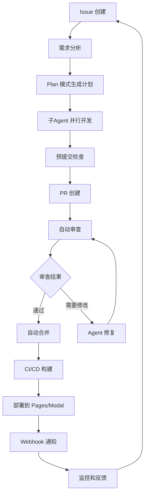
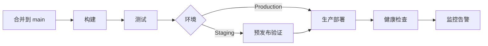
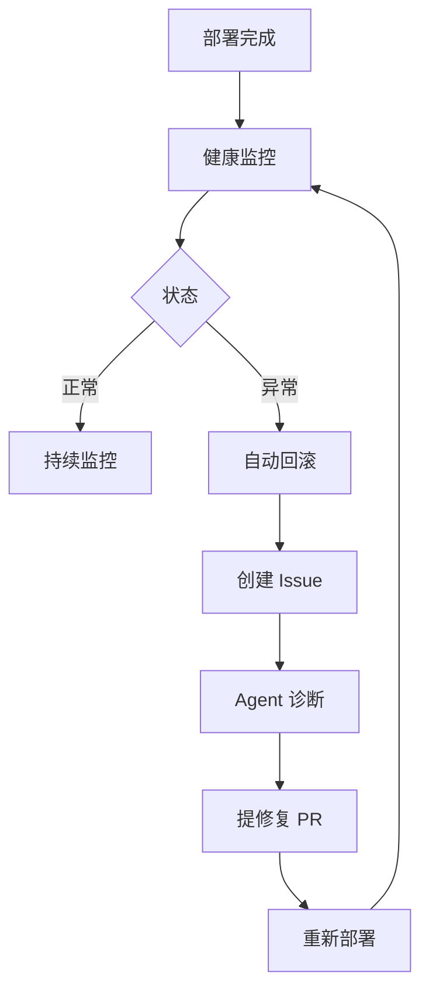

# 现代开发工作流整合

> 本文档整合了本知识库中所有技能和最佳实践，描述了一个完整的、Agent 驱动的现代开发工作流。

## 概述

现代开发工作流将**AI Agent**、**自动化工具**和**最佳实践**整合为一个流畅的开发体验。从需求分析到代码合并，从部署到监控，每个环节都有对应的工具和方法论支持。

### 工作流全景

```
需求 → 规划 → 编码 → 审查 → 测试 → 部署 → 监控
  ↑      ↑       ↑       ↑      ↑      ↑       ↑
 Agent  Plan   Agent  CodeQL   CI/CD  Pages    Webhook
                子Agent         E2E    Modal    RSS
```

---

## 1. 完整的开发循环

### 从 Issue 到部署



### 每小时收益

| 阶段 | 传统方式 | Agent 驱动 | 加速比 |
|------|---------|-----------|-------|
| 需求分析 | 2h | 30min | 4x |
| 代码编写 | 4h | 45min | 5x |
| 代码审查 | 2h | 30min | 4x |
| 测试编写 | 1h | 15min | 4x |
| 部署配置 | 1h | 10min | 6x |
| 文档更新 | 1h | 10min | 6x |
| **总计** | **11h** | **2.3h** | **~5x** |

---

## 2. 需求到计划

### 使用 Plan 模式

```markdown
## 用户请求
"添加用户注册功能，支持邮箱验证"

## Plan 输出

### 分析
1. 需要用户模型、验证码、邮件发送
2. 前后端都需要更新
3. 安全考虑：密码加密、速率限制

### 执行计划

1. [backend] 创建 User 模型和数据库迁移
   - 字段: username, email, password_hash, verified
   - 依赖: 无

2. [backend] 实现注册 API
   - POST /api/auth/register
   - 验证输入 → 创建用户 → 发送验证邮件
   - 依赖: 1

3. [backend] 实现邮件验证
   - 生成验证 token
   - 集成邮件服务
   - 依赖: 2

4. [frontend] 注册页面组件
   - 表单验证、错误提示
   - 依赖: 2

5. [test] 端到端测试
   - 注册 → 验证邮箱 → 登录
   - 依赖: 3, 4

### 估算
- 预计 4 个 Agent 并行工作
- 预计 2 小时完成
```

### 任务委派

```python
# 使用子Agent 并行执行
tasks = [
    {"agent": "backend", "task": "实现注册 API"},
    {"agent": "frontend", "task": "创建注册页面"},
    {"agent": "test", "task": "编写测试"},
    {"agent": "docs", "task": "更新 API 文档"},
]

def dispatch_tasks(tasks):
    for t in tasks:
        # 启动独立的子Agent
        spawn_agent(
            role=t["agent"],
            task=t["task"],
            context={"repo": "my-project", "branch": "feat/register"}
        )
```

---

## 3. 开发与编码

### 编码工作流

```bash
# 1. 创建功能分支
git checkout -b feat/user-register

# 2. Agent 生成代码架构
agent plan "design user register module"
# → 输出: src/auth/register.py, tests/test_register.py 文件结构

# 3. Agent 实现功能
agent implement "实现注册 API
- POST /api/auth/register
- 输入: email, password, username
- 密码使用 bcrypt 加密
- 返回: user_id, token"

# 4. Agent 编写测试
agent test "为注册模块编写测试
- 正常注册
- 重复邮箱
- 密码太短
- 缺少必填字段"

# 5. 预提交检查
pre-commit run --all-files
```

### 代码质量控制

| 检查项 | 命令/工具 | 阈值 |
|--------|---------|------|
| 代码格式 | `ruff format --check` | 0 个错误 |
| 类型检查 | `mypy src/` | 0 个错误 |
| 安全扫描 | `gitleaks detect` | 0 个 Secret |
| 测试覆盖 | `pytest --cov=src` | ≥ 80% |
| 圈复杂度 | `radon cc src/` | ≤ 15 |
| 代码行数 | `wc -l src/**/*.py` | ≤ 500/文件 |

---

## 4. 审查与合并

### 自动审查清单

```yaml
# .github/workflows/auto-review.yml
name: Auto Review

on:
  pull_request:
    types: [opened, synchronize]

jobs:
  review:
    runs-on: ubuntu-latest
    steps:
      - uses: actions/checkout@v4
      
      # 安全扫描
      - uses: gitleaks/gitleaks-action@v2
      
      # 代码质量
      - name: 代码质量检查
        run: |
          ruff check src/
          mypy src/
      
      # 测试
      - name: 运行测试
        run: pytest tests/ --cov=src --cov-fail-under=80
      
      # AI 代码审查
      - name: AI 代码审查
        uses: NousResearch/ai-code-review@v1
        with:
          openai_api_key: ${{ secrets.OPENAI_API_KEY }}
          review_depth: "full"
      
      # 自动批准（检查通过后）
      - name: 自动批准
        if: success()
        uses: actions/github-script@v7
        with:
          script: |
            github.rest.pulls.createReview({
              owner: context.repo.owner,
              repo: context.repo.repo,
              pull_number: context.issue.number,
              event: 'APPROVE',
              body: '✅ 所有自动化检查已通过，可合并'
            })
```

### 合并策略

| 策略 | 命令 | 适用场景 |
|------|------|---------|
| Squash Merge | `gh pr merge --squash` | 单功能分支 |
| Rebase Merge | `gh pr merge --rebase` | 需要线性历史 |
| Merge Commit | `gh pr merge --merge` | 保留分支历史 |

---

## 5. 部署流水线

### 从代码到生产



### 多环境部署

```yaml
name: Deploy

on:
  push:
    branches:
      - main
      - staging

jobs:
  deploy:
    runs-on: ubuntu-latest
    environment: ${{ github.ref_name == 'main' && 'production' || 'staging' }}
    
    steps:
      - uses: actions/checkout@v4
      
      - name: 确定目标
        id: target
        run: |
          if [[ "${{ github.ref_name }}" == "main" ]]; then
            echo "env=production" >> $GITHUB_OUTPUT
            echo "url=https://app.example.com" >> $GITHUB_OUTPUT
          else
            echo "env=staging" >> $GITHUB_OUTPUT
            echo "url=https://staging.example.com" >> $GITHUB_OUTPUT
          fi
      
      - name: 部署
        run: |
          echo "部署到 ${{ steps.target.outputs.env }}"
          # deploy.sh ${{ steps.target.outputs.env }}
      
      - name: 健康检查
        run: |
          curl -f ${{ steps.target.outputs.url }}/health
      
      - name: 发送通知
        run: |
          echo "✅ 部署完成: ${{ steps.target.outputs.url }}"
```

---

## 6. 监控与反馈

### 监控闭环



### Webhook 事件链

```bash
# 1. 部署完成后发送通知
# GitHub → Webhook → Slack/邮件

# 2. 监控阈值触发
# Modal 日志 → 异常检测 → Webhook → Issue 创建

# 3. 日常报告
# Cron Job → RSS 监控 → 摘要 → 邮件通知

# 4. 安全告警
# Dependabot → 自动修复 PR → 审查 → 合并
```

---

## 7. 工具全景图

### 本知识库工具索引

| 环节 | 工具/技能 | 章节 |
|------|----------|------|
| 项目管理 | Linear, GitHub Issues | [[09-生产工具与效率]] |
| 代码开发 | Hermes Agent, 子Agent | [[12-最佳实践与模式]] |
| 代码审查 | CodeQL, Semgrep | [[11-安全与红队]] |
| CI/CD | GitHub Actions, Webhook | [[10-运维与监控]] |
| 文档 | Obsidian, 知识库 | [[12-最佳实践与模式]] |
| 部署 | GitHub Pages, Modal | [[10-运维与监控]] |
| 监控 | BlogWatcher, Webhook | [[10-运维与监控]] |
| 安全 | Dependabot, Gitleaks, GodMode | [[11-安全与红队]] |

---

## 相关技能

- [[01-repo-best-practices]] — 仓库管理最佳实践
- [[02-workflow-patterns]] — 工作流设计模式
- [[03-collaboration-patterns]] — 协作工作流模式
- [[04-knowledge-management]] — 知识管理
